<style>
  .grid-container {
    display: grid;
    grid-template-columns: repeat(3, 1fr);
    gap: 5px;
  }
  .grid-container img {
    width: 100%;
    height: auto;
    object-fit: cover;
  }
</style>

# Snail - A Softbody Physics Simulator

A softbody physics simulator guided and inspired by this [amazing book](https://phys-sim-book.github.io/preface.html) by Minchen Li et al.

<div class="grid-container">
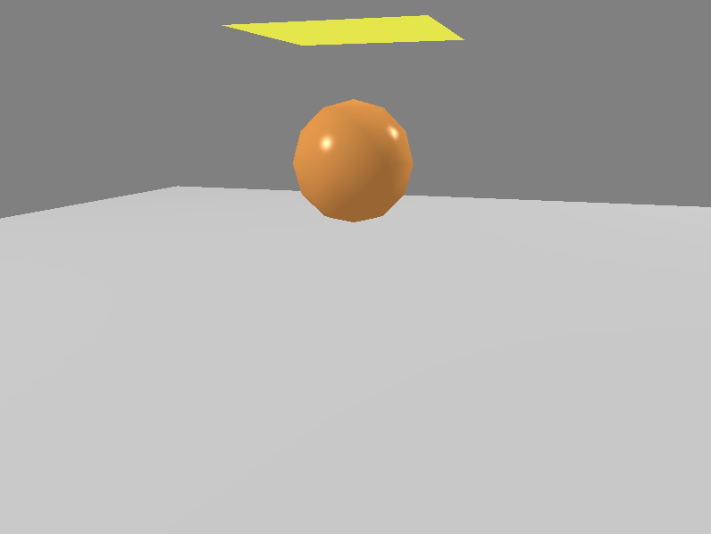
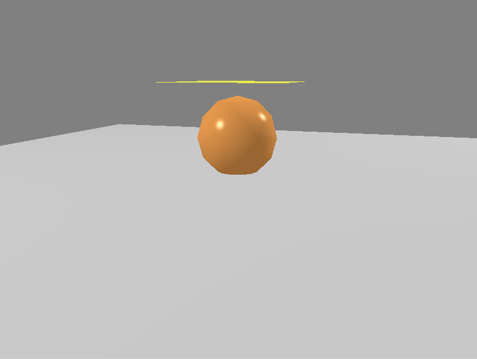
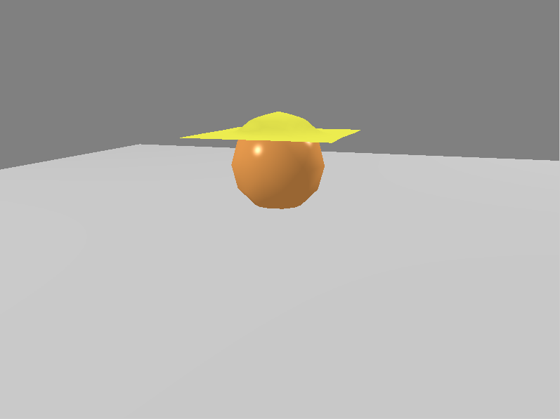
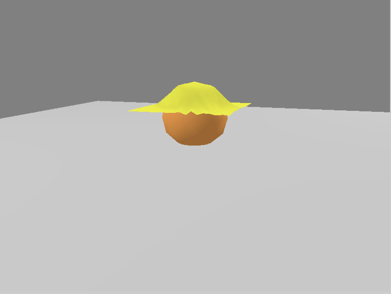
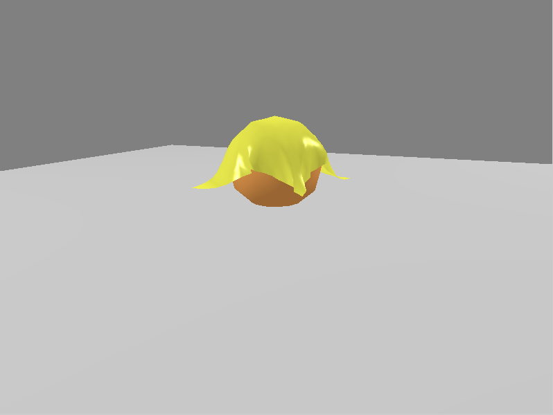
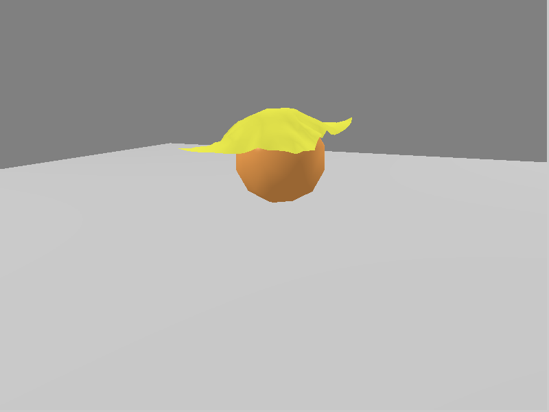
</div>

<br>

<div class="grid-container">
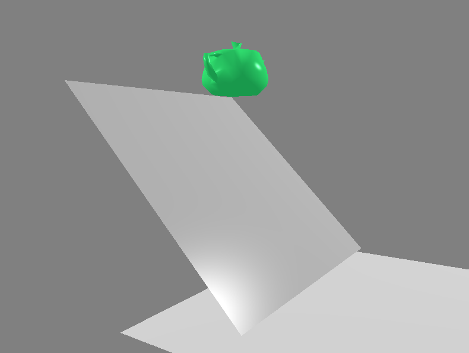
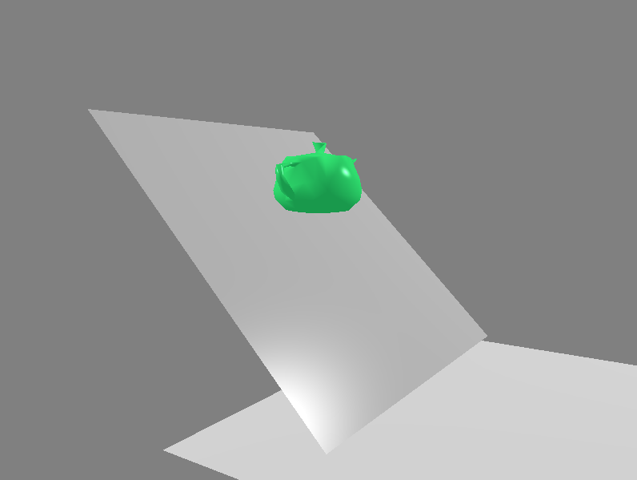
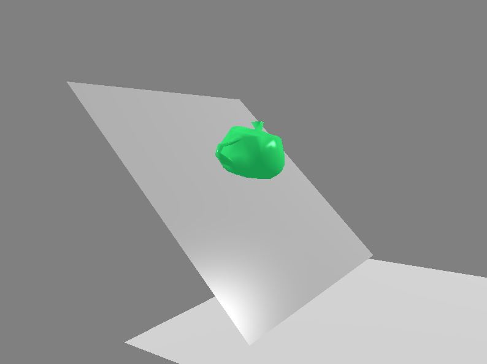
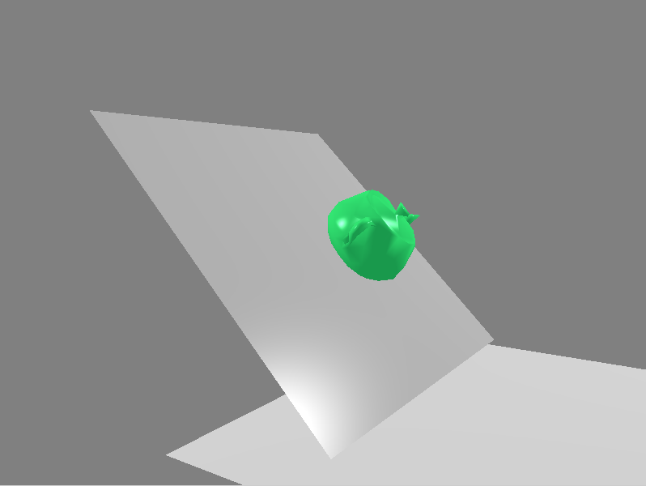
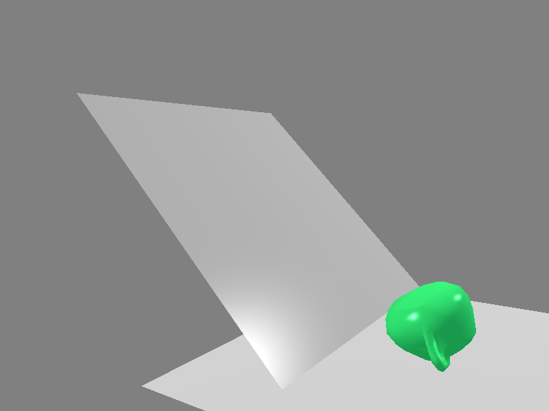
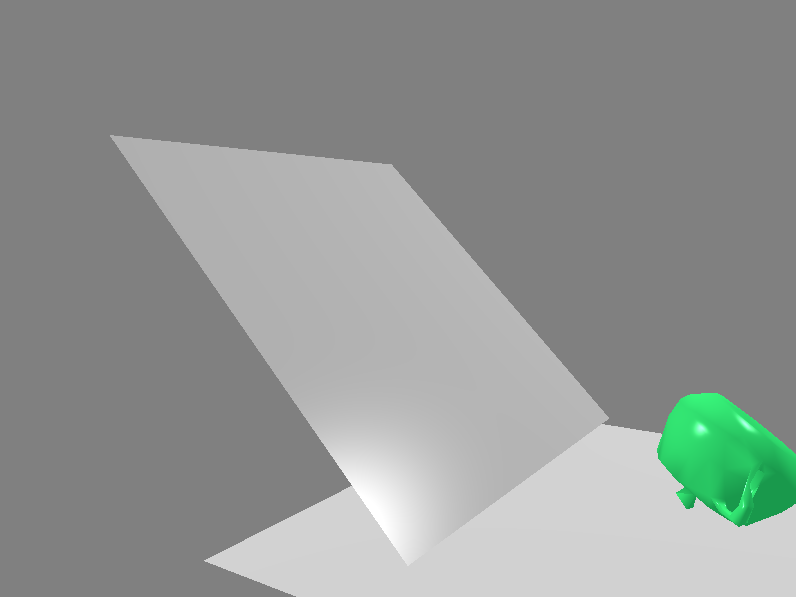
</div>


### Features
- Physics
	- Gravity
	- Spring Elasticity
	- Arbitrary Mesh Contact*
	- Stationary Points
- Solvers & Optimizers
	- Backwards Euler
	- Newton's Method
	- L-BFGS*
- Optimizations
	- Sweep and prune broadphase
	- Sparse hessian solvers
- GUI
	- Blinn-Phong shading
	- Controllable camera, pausing, reseting, stepping
- JSON to Scene Parser
	- See ```resources/scenes``` for examples

*\*still in development\**


### Dependencies
- [GLM](https://github.com/g-truc/glm) under ```GLM_INCLUDE_DIR```
- [GLEW](https://glew.sourceforge.net/) under ```GLEW_DIR```
- [GLFW](https://www.glfw.org/) under ```GLFW_DIR```
- [Eigen](libeigen.gitlab.io) under ```EIGEN3_INCLUDE_DIR```
- CMake

### Build

```bash
// Navigate to snail/
mkdir build
cd build
cmake ..
make -j4
./snail PATH_TO_RESOURCES PATH_TO_SCENE_JSON
```


